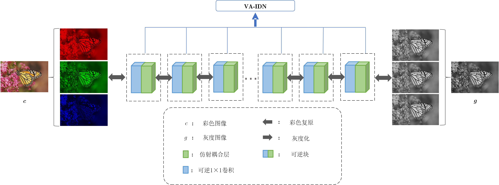

# VA-IDN
Variable Augmented Network for Invertible Decolorization (基于辅助变量增强的可逆彩色图像灰度化)

**Authors**: LIAO Yifan, LI Zihao, WU Chunhua, WANG Guoyou, LIU Qiegen*  

廖一帆, 李子豪, 伍春花, 汪国有, 刘且根. 基于辅助变量增强的可逆彩色图像灰度化[J]. 电子与信息学报. doi: 10.11999/JEIT221205

彩色图像灰度化是一种被广泛应用于各个领域的图像压缩方式，但很少有研究关注彩色图像与灰度图像之间的相互转换技术。该文运用深度学习，创新性地提出了一种基于辅助变量增强的可逆彩色图像灰度化方法。该方法使用变量增强技术来保证输出与输入变量通道数相同以满足网络的可逆特性。具体来说，该方法通过可逆神经网络的正向过程实现彩色图像灰度化，逆向过程实现灰度图像的色彩复原。将所提方法在VOC2012, NCD和Wallpaper数据集上进行定性和定量比较。实验结果表明，所提方法在评价指标上均获得了更好的结果。无论是在全局还是局部，生成图像都可以最大程度地保留亮度、颜色对比度和结构相关性等特征。

## Visulization of the performance of VA-IDN
  
Gcs、Ledecolor和VA-IDN（从(b)到(d)）在NCD、VOC2012和Wallpaper数据集（从上到下）上图像灰度化效果

## The Flowchart of VA-IDN
  

### Other Related Projects

  * Homotopic Gradients of Generative Density Priors for MR Image Reconstruction  
[**[Paper]**](https://ieeexplore.ieee.org/abstract/document/9435335)   [**[Code]**](https://github.com/yqx7150/HGGDP)   [**[PPT]**](https://github.com/yqx7150/HGGDP/tree/master/Slide)   [**[数学图像联盟会议交流PPT]**](https://github.com/yqx7150/EDAEPRec/tree/master/Slide)

 * Iterative Reconstruction for Low-Dose CT using Deep Gradient Priors of Generative Model  
[**[Paper]**](https://ieeexplore.ieee.org/abstract/document/9703672)   [**[Code]**](https://github.com/yqx7150/EASEL)   [**[PPT]**](https://github.com/yqx7150/HGGDP/tree/master/Slide)

  * Universal Generative Modeling for Calibration-free Parallel MR Imaging  
[**[Paper]**](https://biomedicalimaging.org/2022/)   [**[Code]**](https://github.com/yqx7150/UGM-PI)   [**[Poster]**](https://github.com/yqx7150/UGM-PI/blob/main/paper%20%23160-Poster.pdf)    
     
 * Progressive Colorization via Interative Generative Models  
[**[Paper]**](https://ieeexplore.ieee.org/document/9258392)   [**[Code]**](https://github.com/yqx7150/iGM)   [**[PPT]**](https://github.com/yqx7150/HGGDP/tree/master/Slide)   [**[数学图像联盟会议交流PPT]**](https://github.com/yqx7150/EDAEPRec/tree/master/Slide)

 * Diffusion Models for Medical Imaging
[**[Paper]**](https://github.com/yqx7150/Diffusion-Models-for-Medical-Imaging)   [**[Code]**](https://github.com/yqx7150/Diffusion-Models-for-Medical-Imaging)   [**[PPT]**](https://github.com/yqx7150/HKGM/tree/main/PPT) 
